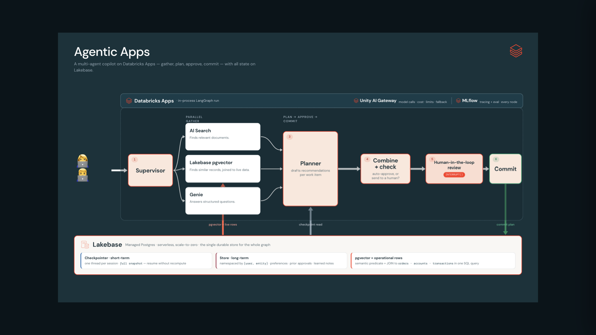

# mfg-supply-chain-copilot-agent

A multi-agent **Supply-Chain Planner Copilot** for manufacturing planners — a reference build for
**custom agents on Databricks with Lakebase**. LangGraph runs on **Databricks Apps**, all durable
state lives on **Lakebase** (Postgres), and retrieval spans Genie, Mosaic AI Vector Search, and
Lakebase pgvector — with human-in-the-loop approval and end-to-end MLflow tracing.

[Use this deck](https://docs.google.com/presentation/d/1RQlKxt7LBplcY4RxngTsdc5Kgs7-E8SAI80oeC1OIuA/edit?slide=id.obj_502548c33f69#slide=id.obj_502548c33f69)



**What it does.** A planner asks a question; a supervisor routes it to the right engine, the
gather agents pull context, a planner proposes a recommendation, a gate decides if approval is
needed, and an `interrupt()` pauses for human approve/reject before `commit`. The whole run is one
resumable MLflow trace, durable across the pause via the Lakebase checkpoint.

- **Supervisor routing** — LLM-based with a keyword fallback.
- **Three gather agents** — Knowledge (Vector Search), Analytics (Genie), Operational (Lakebase
  pgvector hybrid similarity + SQL join to live inventory/POs).
- **Planner + gate** — proposes a structured plan; the gate trips on cost/action-bearing answers.
- **HITL** — `interrupt()` approval card with durable approve/reject resume from the checkpoint.
- **Memory** — short-term threads (`AsyncCheckpointSaver`) + long-term semantic memory
  (`AsyncDatabricksStore`: approvals, preferences, supplier notes), all on Lakebase.
- **App** — React/Vite chat UI with a Backend Explorer drawer and 👍/👎 feedback logged to the trace.

> New to the project? Read **[`CLAUDE.md`](CLAUDE.md)** first — it's the keystone for architecture,
> the Lakebase-pgvector vs. Vector-Search decision, the state/memory model, and conventions.

## Set up with Claude Code (fastest)

This repo is built to be driven by a coding agent. Open it in [Claude Code](https://www.claude.com/product/claude-code)
— it auto-loads [`CLAUDE.md`](CLAUDE.md) and the vendored skills in [`.claude/skills/`](.claude/skills/)
(`quickstart`, `run-locally`, `deploy`, …) — and just ask:

> **Set up this app and run it locally.**

It'll check prerequisites, run `databricks auth login`, `uv sync`, and the frontend install, wire up
`.env`, and start both processes. To ship it, ask:

> **Deploy this to my Databricks workspace** (profile `<p>`)**.**

Prefer to do it by hand? The same steps are spelled out below.

## Run locally

The app is **two processes**: the FastAPI agent backend on `:8000` and the Vite/React frontend on
`:5173` (Vite proxies `/api/*` and `/invocations` → `:8000`). The router uses
`databricks-claude-haiku-4-5`; the planner uses `databricks-claude-opus-4-8` — `LLM_ROUTER_ENDPOINT`
/ `LLM_PLANNER_ENDPOINT` in `.env` take either naming, classic FM API endpoints or `system.ai.*`
AI Gateway routes.

**Prerequisites** — install these before the steps below:

| Tool | Version | Install |
|---|---|---|
| **Databricks CLI** | ≥ 1.3.0 | `brew install databricks/tap/databricks` (or [docs](https://docs.databricks.com/dev-tools/cli/install.html)) — needed for `databricks auth login` and deploy |
| **uv** | latest | `curl -LsSf https://astral.sh/uv/install.sh \| sh` — manages the Python env |
| **Python** | 3.11 or 3.12 | `uv` will fetch it if missing (`<3.13` — see [`pyproject.toml`](pyproject.toml)) |
| **Node + npm** | Node 18+ | [nodejs.org](https://nodejs.org) or `brew install node` — builds/serves the frontend |

You also need a **Databricks workspace** and a CLI profile pointed at it (the `databricks auth
login` step below).

```bash
# one-time
cp .env.example .env                       # then fill in DATABRICKS_CONFIG_PROFILE + catalog/schema/Lakebase/Genie
databricks auth login --host https://<ws>.cloud.databricks.com --profile <name>
uv sync                                    # Python deps
npm --prefix frontend install              # frontend deps

# run — two terminals
uv run start-server                        # Terminal 1 — backend on :8000
npm --prefix frontend run dev              # Terminal 2 — frontend on :5173 (hot reload)
```

Then open **http://localhost:5173**.

- **Offline smoke test** (no workspace round-trips): `USE_STUBS=1 uv run python -m agent_server.graph._smoke`
  runs the full path (supervisor → gather → planner → gate → HITL → commit) against in-memory
  fakes. Stubs also kick in automatically when an endpoint isn't configured.
- **Single-process alternative:** `npm --prefix frontend run build`, then open
  `http://localhost:8000/ui` (the backend serves the built SPA). Two terminals is better while
  iterating on agent code (hot reload).

See [`CLAUDE.md` → Running locally vs. on Databricks](CLAUDE.md#running-locally-vs-on-databricks-auth--config)
for the auth model (local profile vs. ambient credentials on Databricks).

## Deploy to Databricks

One command stands up the whole demo — the App (agent + UI at `/ui`), an MLflow experiment, the
Lakebase project, the Genie space, and a setup-and-seed job for the demo dataset. It's idempotent
and cold-start-safe.

```bash
make deploy      PROFILE=<p>              # full one-shot: build · deploy · seed · Genie · verify
make deploy      PROFILE=<p> TARGET=demo  # clean prod-style names (default: dev)
make redeploy    PROFILE=<p>              # FAST: agent-server code change → deploy + restart (~30-60s)
make redeploy-ui PROFILE=<p>              # FAST: frontend change → build + deploy + restart
```

**Prereqs (one-time):** the tools from the [Prerequisites](#run-locally) table above, plus
**workspace admin** on the target workspace and a **writable UC catalog**. The Lakebase project,
Genie space, and seed are all handled by the deploy — no manual setup steps.

> **A few env gotchas bite the first deploy** — none obvious from the error text (full list:
> [`docs/DEPLOYMENT_GUIDE.md` §8](docs/DEPLOYMENT_GUIDE.md#8-troubleshooting)):
> 1. **Public PyPI is blocked** (Jamf-managed `/etc/hosts` — don't edit it). If `uv`/`make deploy`
>    fail with `Connection refused (os error 61)`, point uv at the internal proxy first:
>    `export UV_INDEX_URL=https://pypi-proxy.cloud.databricks.com/simple`.
> 2. **Databricks Connect needs compute.** If you hit `Cluster id or serverless are required`, add
>    `serverless_compute_id = auto` to your `[<profile>]` in `~/.databrickscfg`. Preflight warns if
>    it's missing.
> 3. **`uc_catalog` doesn't exist on this workspace.** The committed default is just a starting
>    point — preflight fails fast with `--uc-catalog <name>` (or `--var uc_catalog=<name>`) if it's
>    not there, instead of burning the ~10min Lakebase-provisioning wait first.
> 4. **Catalog is shared with other projects.** If seeding fails with `create-synced-table ... Table
>    already exists pointing to a different project`, another project's Synced Tables already own
>    `<catalog>.public.<table>` (even orphaned ones block the name). Override
>    `VARS="lakebase_operational_schema=<unique-name>"` to a schema unique to this deployment.
>
> Hitting `Genie Space resources are only supported with direct deployment mode` or
> `lineage mismatch in state files` on a workspace you've deployed to before? Those are the
> Terraform→direct engine migration and stale-state-cache cases — see the troubleshooting guide.

### Which deploy fits your access

The right command depends on what you're allowed to create on the workspace:

| Your access | Use | Why |
|---|---|---|
| Can create a SQL warehouse (default) | `make deploy PROFILE=<p>` | The bundle creates its own small serverless warehouse for tracing + Genie and binds it to the app. |
| **Can't** create a warehouse (restricted workspace) | `make deploy PROFILE=<p> TARGET=byo VARS="sql_warehouse_id=<existing-id>"` | The `byo` target omits the warehouse resource and reuses one you already have `CAN USE` on. Everything else is identical. |
| Want clean, non-user-prefixed names (shared demo) | add `TARGET=demo` | `mode: production` naming instead of the user-prefixed `dev` names. |
| Bringing your own data (skip the demo seed) | add `SEED=false` | Deploys the app + infra but skips the setup-and-seed job. |
| `uc_catalog` is shared across projects/teams | add `VARS="lakebase_operational_schema=<unique-name>"` | Synced Tables are namespaced `catalog.schema.table`; the default `public` schema can collide with another project's tables of the same name. |

You can also point at your own catalog/schema inline without editing `databricks.yml`, e.g.
`VARS="uc_catalog=main uc_schema=planner"`. Full option list: [`docs/DEPLOY.md`](docs/DEPLOY.md).

- **Quick reference:** [`docs/DEPLOY.md`](docs/DEPLOY.md).
- **Full new-workspace walkthrough + permissions checklist:** [`docs/DEPLOYMENT_GUIDE.md`](docs/DEPLOYMENT_GUIDE.md).
- **Never delete the app — redeploy in place.** Deleting the App destroys its service principal and
  orphans the Lakebase-owned schemas. See [`docs/lakebase-apps-permissions.md`](docs/lakebase-apps-permissions.md).

## Try it

Seed-data anchors (use the exact values): **Henkel AG (SUP-001)**, hero SKU **SKU-1001**
(Structural Epoxy Adhesive), **40 on-hand** at DC-EAST, open POs **500** (Henkel, PO-2026-0042)
\+ **300** (DuPont, PO-2026-0043) = **760-unit gap**; Henkel status **at_risk (82.0)**; alternate
supplier **DuPont (SUP-002)**. Demo "today" = 2026-06-05.

**Single-engine routing** — verify the router picks the right agent:

| Question | Routes to |
|---|---|
| What is the total open PO quantity by supplier for Q4 2026? | analytics (Genie) |
| What do our Caterpillar contracts say about late-delivery penalties? | knowledge (Vector Search) |
| Find similar past quality incidents to Henkel's SKU-1001 adhesive cracking. | operational (Lakebase hybrid SQL) |

**The hero loop (multi-agent + HITL):**

> *Henkel's SKU-1001 has recurring adhesive cracking — show me similar past cases joined to on-hand
> inventory and open POs, and recommend a mitigation.*

→ `interrupt()` fires → approval card; the run pauses (Lakebase checkpoint); approve → `commit`
writes memory. Also test the **reject** path: approvals are always written (audit), but
preferences/supplier-notes are written **only on approve**.

**Cross-session memory:** seed memory via `GET /_seed_demo_memories` (or run/approve the hero
question), then in a **new** chat ask *"How should we handle the Henkel SKU-1001 coverage gap?"* →
`hydrate_memory` recalls the prior approved decision and the planner cites it.

**Suggested 10-minute sequence:** single-engine #1 → single-engine #3 (show the hybrid SQL) → hero
loop (HITL approve + commit) → new chat, cross-session recall. That hits the router, all three
gather engines, HITL, checkpoint durability, and long-term memory.

## Repo map

| Path | What |
|---|---|
| [`CLAUDE.md`](CLAUDE.md) | Shared context — read first |
| [`.env.example`](.env.example) | Local config template (`cp` → `.env`) |
| [`pyproject.toml`](pyproject.toml) | Dependency contract (`uv sync`) + the `start-server` entrypoint |
| [`databricks.yml`](databricks.yml) | DABs bundle — App, Lakebase, Genie space, experiment, seed job, `dev`/`demo` targets |
| [`Makefile`](Makefile) / [`scripts/`](scripts/) | Deploy + redeploy wrappers; `scripts/deploy.sh` holds all deploy logic |
| [`agent_server/`](agent_server/) | FastAPI server, agent (`@invoke`/`@stream`), web routes, config, the `graph/` (supervisor + gather + planner + gate + HITL + commit), `tools/`, long-term `memory.py`, `evaluation/` flywheel |
| [`data/`](data/) | Synthetic operational data, the pgvector hybrid query, the Knowledge VS pipeline, and the Genie schema + space creation |
| [`frontend/`](frontend/) | React + Vite chat UI (dev on `:5173`; built SPA served at `/ui`) |
| [`.claude/skills/`](.claude/skills/) | Vendored, pinned build + Databricks + MLflow skills |

## Docs

- [`docs/architecture.md`](docs/architecture.md) — multi-agent design, topology, the pgvector/VS split, [end-to-end diagrams](docs/architecture.md#end-to-end-architecture)
- [`docs/DEPLOY.md`](docs/DEPLOY.md) · [`docs/DEPLOYMENT_GUIDE.md`](docs/DEPLOYMENT_GUIDE.md) — deploy quick reference and full walkthrough
- [`docs/lakebase-apps-permissions.md`](docs/lakebase-apps-permissions.md) — App SP + Lakebase schema ownership
- [`docs/storyboard.md`](docs/storyboard.md) — the demo scenarios + planner persona
- [`docs/references.md`](docs/references.md) — all code/demo/doc links

## Primary reference

Built on the
[`agent-langgraph-advanced`](https://github.com/databricks/app-templates/tree/main/agent-langgraph-advanced)
template (LangGraph + Lakebase memory + MLflow). This repo swaps the template's Next.js UI for a
Vite + React frontend and ships its own vendored skills.
