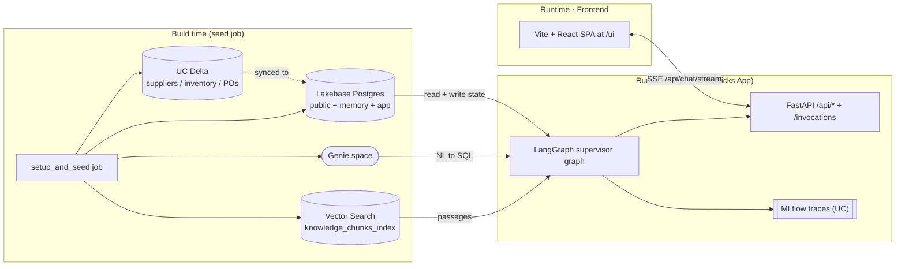
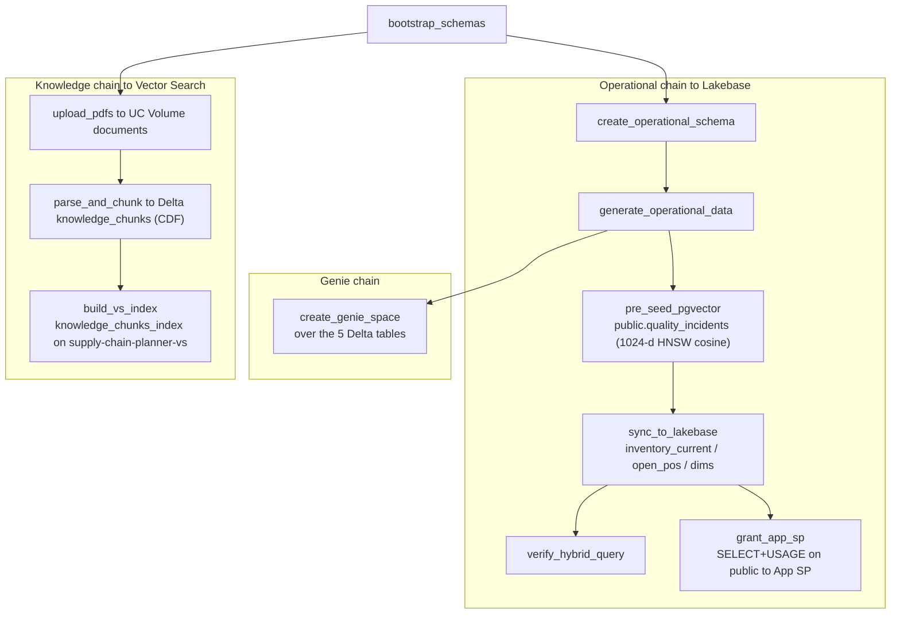
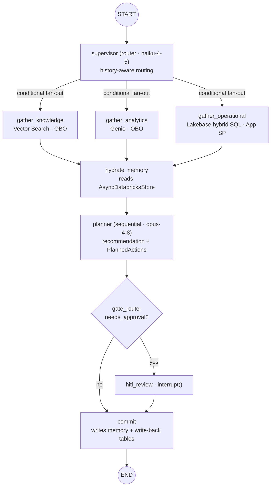
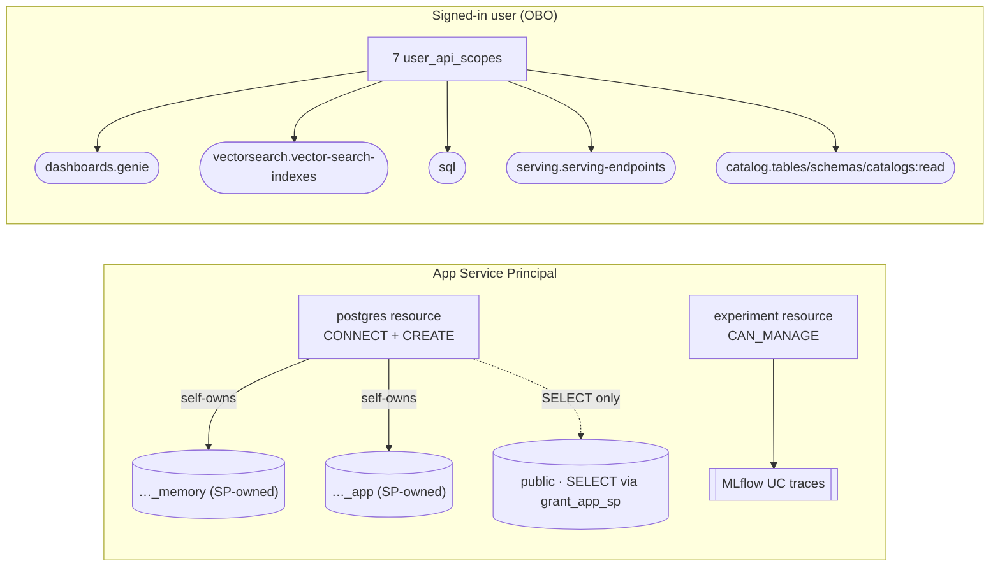

# Architecture — Supply-Chain Planner (Multi-Agent)

A multi-agent planning system on **Databricks Apps** that decomposes a planning request across
specialized agents, produces recommendations with **human-in-the-loop approval**, and is
instrumented end-to-end with **MLflow**. Built on **LangGraph** with all durable state on
**Lakebase**. It shows when to use **Lakebase + LangGraph** vs **Mosaic AI Vector Search**.

> Source: Google Doc "Lakebase for the GenAI/ML Persona Storyboard" (Architecture + Copilot
> tabs), refined to the **Databricks-native LangGraph + Lakebase integration** (see below).

## End-to-end architecture

Four layered Mermaid views, narrow → wide: the hero overview, then the build-time seed pipeline,
the agent runtime graph, and the permissions/identity map. Node/table/endpoint names match the
code (`databricks.yml`, `agent_server/graph/build_graph.py`, `agent_server/tools/operational_tool.py`,
`data/**`, `agent_server/config.py`).

### Diagram 1 — End-to-end overview

The "simple but effective" hero view: a one-shot **seed job** lays down UC Delta + Lakebase
(operational + memory) + Genie + Vector Search; the **LangGraph App** reads those surfaces, writes
durable state back to Lakebase, and emits MLflow traces; the **Vite + React SPA at `/ui`** talks to
the App's FastAPI `/api/*` endpoints.



### Diagram 2 — Data / seed pipeline

The `setup_and_seed` DABs job: a `bootstrap_schemas` task, then three independent chains
(operational → Lakebase, Genie, knowledge → Vector Search). Task keys and table/index names are
verbatim from `databricks.yml`.



### Diagram 3 — Agent runtime graph

The LangGraph topology with real node names (`build_graph.py`). `supervisor` fans out (conditional
edge → list) to the gather siblings in one superstep; they fan in on `hydrate_memory`; the planner
is **sequential** today (per-SKU/supplier `Send` fan-out is P2); `gate_router` conditionally routes
to `hitl_review` (the durable `interrupt()`) or straight to `commit`. Each gather node is annotated
with its backend + auth. Both `supervisor` and `planner` read the thread's recent conversation
history from the checkpointer (short-term memory), so follow-ups resolve in context — router
history-awareness is gated by `ROUTER_USE_HISTORY` (default on).



### Diagram 4 — Permissions / UC + OBO map

Two identity lanes. The **App Service Principal** carries non-OBO work: the `postgres` app resource
grants CONNECT+CREATE so the SP self-owns its `…_memory` + `…_app` schemas at startup; the seed's
`grant_app_sp` adds SELECT on `public`; the experiment resource grants CAN_MANAGE for UC traces. The
**signed-in user (OBO)** carries the 7 `user_api_scopes` for Genie / Vector Search / UC reads /
serving. The dashed line is the Lakebase schema-ownership boundary.



## Topology

The runtime graph is shown in **Diagram 3** above (real node names from `build_graph.py`).
The original ASCII sketch is superseded by that diagram.

## Key decisions

- **LangGraph over OpenAI Agents SDK.** Lakebase is Postgres, so the checkpointer and long-term
  store come essentially free; `interrupt()` gives durable HITL; MLflow autologs LangGraph traces.
- **Databricks Apps, not Model Serving.** Planning runs execute in-process as background work
  with the UI polling state — Apps times out long synchronous requests, and the durable
  checkpoint makes a run resumable across app restarts.
- **On-behalf-of-user (OBO) auth** for Knowledge (Vector Search) and Analytics (Genie), via the
  app's `user_api_scopes`. The Operational agent runs as the **App service principal** against
  Lakebase, so every authenticated app user sees the same UC-governed data — there is no per-user
  row scoping (see the Operational-agent section for the production options).

## State, memory & the pgvector path — LangGraph + Lakebase integration

**The Lakebase + LangGraph integration lives in `databricks-langchain` and manages the tables,
connection pooling, and vector index for you. You do not hand-manage a pgvector client.**

- **Short-term — `AsyncCheckpointSaver`.** Thread/session state and checkpoints, one thread per
  planning session. The whole state snapshots every superstep; per-task pending writes mean a
  partial-failure resume doesn't re-run already-succeeded gather branches (no recompute of
  expensive Genie / store / Vector Search calls). HITL `interrupt()` resumes from here. It also
  holds the thread's **conversation history** (`messages`, `add_messages` reducer): the recent
  window — `short_term_keep_recent` (6) turns — is rendered into both the **router** (history-aware
  routing, gated by `ROUTER_USE_HISTORY`, default on) and the **planner** prompts so follow-up
  referents ("their pricing terms", "that SKU") resolve in context. The full log is checkpointed;
  only the window is rendered (older turns dropped, not summarized).
- **Long-term + semantic — `AsyncDatabricksStore`.** A Lakebase-backed LangGraph Postgres store
  with embeddings configured via a Databricks **embedding endpoint** (`embedding_endpoint`,
  `embedding_dims`, `embedding_fields`). **This is the pgvector path** — internally it builds an
  index config and an `AsyncPostgresStore(conn, index=...)`, persisting memory + vectors in
  Postgres tables (`store`, `store_vectors`, `store_migrations`, `vector_migrations`) and serving
  semantic search over stored memory. Namespaced by `(planner, entity)`: preferences, prior
  approvals, learned supplier notes; hydrated at run start, written at commit.
- **Connections & creds.** Both wrappers use a managed `LakebasePool` / `AsyncLakebasePool` and
  generate short-lived OAuth DB credentials via the Databricks SDK (no hard-coded secrets). In
  autoscaling mode the SDK resolves the branch's read-write endpoint/host.
- **Embeddings are configured on the store**, generated at write/search time through the endpoint
  — **not** via `ai_query` (which is irrelevant to the Lakebase storage path here).

```python
from databricks.sdk import WorkspaceClient
from databricks_langchain import AsyncCheckpointSaver, AsyncDatabricksStore, ChatDatabricks
from langchain.agents import create_agent

w = WorkspaceClient()
checkpointer = AsyncCheckpointSaver(project=PROJECT, branch=BRANCH, workspace_client=w, schema=SCHEMA)
store = AsyncDatabricksStore(
    project=PROJECT, branch=BRANCH, workspace_client=w, schema=SCHEMA,
    embedding_endpoint="databricks-gte-large-en", embedding_dims=1024, embedding_fields=["$"],
)
await store.setup()  # creates schema + store/store_vectors/migration tables
agent = create_agent(model=ChatDatabricks(endpoint=LLM_ENDPOINT), tools=[...],
                     checkpointer=checkpointer, store=store, state_schema=AgentState)
```

**Mental model:** checkpointer = "what happened in this thread?"; `DatabricksStore` = "what should
the agent remember across threads, and what semantically similar memories should it retrieve now?"

### LangGraph state discipline
Gather agents write **distinct** state keys (no reducer) — `knowledge_result`, `analytics_result`,
`operational_result`. The one reducer in play is `add_messages` on `messages` (the short-term
conversation log; see above). The planner is **sequential** today: it composes a single `recommendation`
(`PlannerRecommendation`) plus its ordered, per-action `PlannedAction`s into one state key (no
reducer needed). Per-SKU/supplier planner fan-out via `Send` — which would need a reducer over a
shared list key — is a **P2** item, not the current shape. Bulk payloads go to side tables; state
holds references (every superstep serializes the full snapshot).

## The Operational agent — similarity + SQL joins in one query

The differentiator: when a question needs **semantic similarity as one predicate inside a
relational/operational query**, run it against the same Lakebase backend so similarity + joins
resolve in ONE governed SQL statement — instead of pulling IDs from a vector index and
round-tripping to Postgres to join and re-filter.

**Canonical case.** *"Similar quality issues for this supplier, joined to on-hand inventory and
open POs."*

The real query lives in `agent_server/tools/operational_tool.py` (`HYBRID_SQL`, schema-qualified to
`public` and kept in sync with `data/operational/04_verify_hybrid_query.py`):

```sql
SELECT m.incident_id, m.summary, m.supplier_id, m.sku, m.category,
       i.on_hand_qty, po.open_po_qty,
       round((1 - (m.embedding <=> %(q)s::vector))::numeric, 3) AS similarity
FROM public.quality_incidents m
JOIN public.inventory_current i  ON m.sku = i.sku
JOIN public.open_pos          po ON m.supplier_id = po.supplier_id AND m.sku = po.sku
WHERE m.expired_at IS NULL
ORDER BY m.embedding <=> %(q)s::vector
LIMIT 5;
```

The similarity predicate runs over `public.quality_incidents` — a NATIVE pgvector table
(1024-d, HNSW, cosine) pre-seeded via the `databricks-gte-large-en` embedding endpoint. The query
runs as the **App service principal**, so every authenticated app user sees the same UC-governed
data (no per-user row scoping; see the access-control note below). The relational tables
(`inventory_current`, `open_pos`, plus `suppliers` / `product_dim` / `supplier_status` dims) reach
Lakebase via **Synced Tables** — the two live tables follow `LAKEBASE_SYNC_MODE` (Snapshot by
default for the static demo, flip to Continuous/CDF for a live-update demo); the dims are always
Snapshot — so the joins hit fresh OLTP rows.

> **Access control.** A demo-only `user_access` ACL + an in-query `JOIN user_access ON
> ua.user_id = …` predicate used to scope rows per user, but it silently returned zero rows for any
> user not seeded by the data-gen job (every FE/customer), so it was removed. Per-user product-code
> scoping in production would be Postgres RLS keyed on `current_user()` (with per-user/OBO DB
> connections) or an entitlements join driven by a real identity source — not an app-side ACL table.

## Lakebase vs Mosaic AI Vector Search

| Dimension | Mosaic AI Vector Search | Lakebase (LangGraph store + SQL) |
|---|---|---|
| Data nature | large unstructured knowledge corpus | agent memory + operational records co-located with entities |
| Vector storage | managed index over Delta | LangGraph `DatabricksStore` (Postgres `store_vectors`) |
| Operational join | app-side, multi-hop | native SQL join, single query |
| Row-level access | index filters / app-side | in-query predicate / Postgres grants |
| Scale | large corpora (100Ks–>100M), managed HNSW | small-to-moderate sets co-located with state |
| Managed RAG features | ingestion, hybrid retrieval, reranking | not built-in |
| Output | passages | rows + operational context |

**Routing:**
- **Lakebase + LangGraph** when the agent needs memory + semantic similarity + live SQL joins in
  one operational query path.
- **Mosaic AI Vector Search** for large-scale managed RAG over broad document corpora (managed
  ingestion, hybrid retrieval, reranking, large vector counts).
- **Genie** for structured business questions (*"total unfulfilled demand by product code for Q4/Q1?"*).

## Human-in-the-loop

`interrupt()` in a dedicated review node **after** fan-in, kept out of any parallel step so a
resume doesn't drag sibling tasks into re-execution. The run pauses durably; the planner can
re-engage on an edit; the approve/edit/reject verdict feeds long-term memory. The App uses a
**two-call resume pattern** around the pause.

## Models & observability

- **Models:** `ChatDatabricks` against Databricks Foundation Model APIs — fast model for the
  router, mid-tier for retrieval + Genie-wrapper agents, strongest model for the planner. MLflow
  tags model-per-span to attribute cost/latency/quality by layer.
- **Observability:** MLflow tracing autologged across nodes (span, model, cost, latency). Eval
  dimensions: routing correctness, retrieval relevance, operational SQL/join correctness,
  recommendation quality, escalation correctness. The Operational agent **returns its generated
  SQL** so the join is traceable and scorable.

## Helpful resources

- Stateful agents: https://docs.databricks.com/aws/en/generative-ai/agent-framework/stateful-agents
- Reference template: https://github.com/databricks/app-templates/tree/main/agent-langgraph-advanced
- Databricks agent skills: https://github.com/databricks/databricks-agent-skills
- MLflow skills: https://github.com/mlflow/skills
- Banking agent accelerator (state-machine + async-checkpoint HITL): https://github.com/databricks-industry-solutions/banking-agent-accelerator
