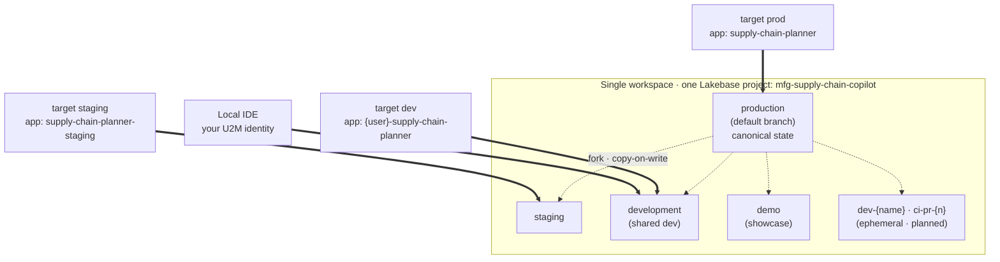
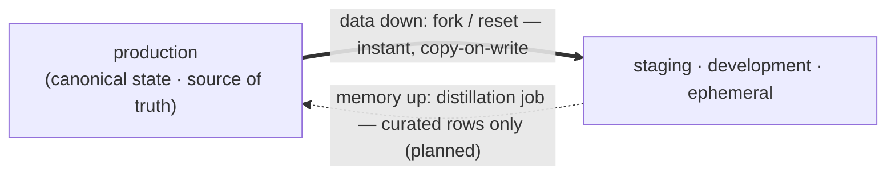

# Lakebase state lifecycle — dev → staging → prod

> How the agent's durable state (LangGraph checkpointer + long-term/semantic store + Meridian
> write-back) is isolated per environment and promoted between them. For the deep permission/ownership
> mechanics see [`lakebase-apps-permissions.md`](lakebase-apps-permissions.md); for the deploy flow see
> [`DEPLOY.md`](DEPLOY.md).

## The model: one project, branch-per-environment

All durable state lives on **Lakebase (Postgres)**. We run **one autoscaling Lakebase project** and
give **each environment its own copy-on-write branch** — not a separate project per environment. The
branch is the isolation boundary: dev, staging, and prod each read and write their own copy of the
agent state, and lower branches are forked from `production`.

- **Agent state** (checkpointer, store/`store_vectors`, write-back) — isolated per branch.
- **Operational data** (the `public` synced tables) — a prod-shaped snapshot forked onto each branch.
- **Analytics** (UC catalogs/schemas) — a separate concern, set per-tier via `uc_catalog`/`uc_schema`.

Lakebase is workspace-scoped, so this assumes one workspace. A locked-down prod in its own workspace
would use a separate project (point `lakebase_project` at it per-target).

## Topology



Solid arrows = a DABs target/app deploys to and reads+writes that branch; dotted arrows =
copy-on-write fork from `production`.

| Tier | DABs target | Lakebase branch | App name | Agent-state schemas |
|------|-------------|-----------------|----------|---------------------|
| Local IDE | — | `development` (via `.env`) | — | `dev_<you>_memory` / `_app` |
| Dev | `dev` (default) | `development` | `<user>`-prefixed | `dev_memory` / `dev_app` |
| Staging | `staging` | `staging` | `supply-chain-planner-staging` | `staging_memory` / `staging_app` |
| Prod | `prod` | `production` | `supply-chain-planner` | `supply_chain_planner_memory` / `_app` |
| Demo (legacy) | `demo` | `production` | `supply-chain-planner` | canonical |
| BYO (restricted ws) | `byo` | `production` | `<user>`-prefixed | canonical |

`production` is the project's **default branch** (created with the project); the others are **forked
from it** copy-on-write by the deploy script the first time you deploy that tier. `demo` is a showcase
alias of `prod`; use `prod` for the lifecycle. `byo` targets a restricted workspace where you bring an
existing SQL warehouse.

## Why agent-state schema names differ per tier

Prod uses the canonical schema names (`supply_chain_planner_memory` / `_app`) — it created them, so it
owns them. But a branch forked from prod inherits those schemas **still owned by the prod app service
principal**, and on Lakebase nobody (not even the deployer) can drop or reassign them — there's no
usable superuser. A different-SP tier (dev/staging) trying to reuse the canonical name would crash on
startup with "permission denied."

So rather than fight it, each non-prod tier uses its **own** schema names (`staging_memory`,
`dev_memory`, …). The tier's app SP creates and owns those fresh on first boot; the inherited prod
schemas just sit there unused. (`public` is platform-owned, so it needs no rename — the seed's
`grant_app_sp` task just re-grants the tier SP read access.)

> Caveat: the background-response store uses a hard-coded schema name (`agent_server`) we can't
> rename, so on non-prod tiers it stays prod-owned and **background mode degrades** — non-fatal; the
> normal invoke/stream, agent memory, and write-back paths all work. Full mechanics:
> [`lakebase-apps-permissions.md`](lakebase-apps-permissions.md).

## Promotion: code goes up, data goes down



The two flows move in opposite directions:

- **Code & schema promote up** (dev → staging → prod) via DABs deploy plus idempotent DDL (the
  `ensure_*` startup functions use `CREATE … IF NOT EXISTS`).
- **Data & memory flow down** (prod → staging/dev) by forking or resetting from `production` — instant
  and free. There is **no** child→parent merge: canonical memory lives on `production`, lower branches
  are throwaway, and curated memory is promoted up later by a distillation job (planned).

## Environment awareness

The DABs target is surfaced to the app as **`APP_ENV`** (read as `settings.app_env`) and stamped on
every MLflow trace as `environment=dev|staging|prod`, so traffic is separable in observability.
Defaults to `local` for IDE runs.

## Local development

Run locally against the `development` branch with **your own** schema names — never the app SP's. This
is the same tier-named-schema idea as the deployed tiers, where the "tier" is you (it also means a
local run can't corrupt shared state):

```
LAKEBASE_AUTOSCALING_BRANCH=development
LAKEBASE_AGENT_MEMORY_SCHEMA=dev_<you>_memory
LAKEBASE_WRITEBACK_SCHEMA=dev_<you>_app
```

## Operational guardrails

- **Never delete the app — redeploy in place.** The app SP owns its Lakebase schemas and is destroyed
  on app delete, orphaning them. If you must recreate, detach the Lakebase resource as `CAN MANAGE`
  first. See [`lakebase-apps-permissions.md`](lakebase-apps-permissions.md).
- **Grants survive redeploys** (they're app-resource bindings), but `SELECT` on the `public` synced
  tables comes from the seed's `grant_app_sp` task — re-run the seed after an SP recreate.
- **Branch limit:** 10 unarchived branches per project — clean up stale `dev-*` / `ci-*` branches.

## Roadmap

**Done:** branch-per-environment (`dev`/`staging`/`prod` targets) · tier-named agent-state schemas ·
automated branch provisioning (forks from prod if missing, fails loud otherwise) · `APP_ENV` on traces.

**Planned:** per-developer / per-PR ephemeral branches with a TTL reaper · CI/CD regression gate on
PRs (ephemeral branch → flywheel) · scheduled staging reset-from-prod + memory distillation ·
per-branch state monitoring.

## Usage

```bash
make deploy PROFILE=<p> TARGET=dev       # → development branch (default)
make deploy PROFILE=<p> TARGET=staging   # → staging branch (forked from production if missing)
make deploy PROFILE=<p> TARGET=prod      # → production branch

# Per-developer isolation: your own branch, or your own schema on the shared branch
make deploy PROFILE=<p> TARGET=dev --var lakebase_branch=dev-<you>
make deploy PROFILE=<p> TARGET=dev --var lakebase_agent_memory_schema=dev_<you>_memory \
                                   --var lakebase_writeback_schema=dev_<you>_app
```

## A worked example: changing the approval gate on `dev`

To make the lifecycle tangible, here's an end-to-end change against the **`dev` target**. Say Priya
wants to **lower the approval gate** so any PO reschedule over **$50k** (down from $100k) trips
human-in-the-loop, and to **teach the agent a new long-term preference** ("for part `BRK-204`, prefer
alternate supplier `Acme-West`"). Both touch durable state — the gate's decision is traced through the
checkpointer, and the preference is written to the semantic store — so this is exactly the kind of
change the branch-per-environment model is meant to isolate.

### 1. First `dev` deploy forks prod-shaped state for free

The first time Priya runs:

```bash
make deploy PROFILE=<p> TARGET=dev        # TARGET defaults to dev anyway
```

`deploy.sh` Phase 1 (`ensure_lakebase_project.py`) sees the `development` branch is missing and **forks
it from `production` copy-on-write** — instant and free. She immediately has a **prod-shaped snapshot**
of the operational `public` tables (inventory, open POs, suppliers) to test against, without copying a
byte. Her agent-state schemas `dev_memory` / `dev_app` are **created fresh and owned by the dev app
SP** on first boot (the inherited canonical `supply_chain_planner_*` schemas come along on the fork but
stay prod-owned and unused — see "Why agent-state schema names differ per tier"). The seed job is only
needed for a from-scratch project; on a forked dev branch the data is already there.

### 2. Inner loop: iterate locally first

Before touching the shared `dev` branch, Priya iterates locally against the **same `development`
branch but with her own schemas**, so a local run can't corrupt shared dev state:

```
LAKEBASE_AUTOSCALING_BRANCH=development
LAKEBASE_AGENT_MEMORY_SCHEMA=dev_priya_memory
LAKEBASE_WRITEBACK_SCHEMA=dev_priya_app
```

She edits the gate threshold in `agent_server`, runs the two processes (FastAPI `:8000` + Vite
`:5173`), and asks the agent to *"reschedule PO-4471 for part BRK-204."* The gate now trips at $50k and
the agent pauses on an `interrupt()` approval card; after she approves, the alternate-supplier
preference lands in `dev_priya_memory`. Traces are stamped `environment=local`. The new DDL for any
added store table is created by the `ensure_*` startup functions (`CREATE … IF NOT EXISTS`), so there's
no migration step — booting the app is the migration.

### 3. Push to the shared `dev` target

Happy with it locally, Priya promotes the **code** (not the data) to the shared dev app:

```bash
make redeploy PROFILE=<p> TARGET=dev      # app-only: bundle deploy + restart, ~30–60s
```

This deploys to the user-prefixed dev app (`{user}-supply-chain-planner`), reading and writing the
shared `development` branch with the `dev_memory` / `dev_app` schemas. Every run is stamped
`APP_ENV=dev` → `environment=dev` on its MLflow trace, so her dev traffic is cleanly separable from
staging and prod in observability. (Background-response mode degrades on non-prod tiers because its
`agent_server` schema is hard-coded and prod-owned — fine for a dev loop; normal invoke/stream, memory,
and write-back all work.)

### 4. Avoid collisions with a teammate on `dev`

If someone else is also iterating on the shared `development` branch and Priya wants her experiments
isolated, she takes her own branch (forked from prod) or her own schema on the shared branch:

```bash
make deploy PROFILE=<p> TARGET=dev --var lakebase_branch=dev-priya
# or keep the shared branch but isolate just the agent state:
make deploy PROFILE=<p> TARGET=dev --var lakebase_agent_memory_schema=dev_priya_memory \
                                   --var lakebase_writeback_schema=dev_priya_app
```

### 5. Reset when test state gets messy

After a dozen approve/reject runs the dev memory is full of throwaway approvals and preferences. Since
**data flows down, never up**, Priya just re-forks `development` from `production` to get a clean
prod-shaped slate back — instant, free, no merge. (Scheduled reset-from-prod is on the roadmap; today
it's a manual re-fork.) Nothing of value is lost: lower branches are disposable by design.

### 6. Promote up to staging, then prod

Once the change is solid, it moves **up the tiers as code + idempotent DDL** — never by pushing dev
data anywhere:

```bash
make deploy PROFILE=<p> TARGET=staging    # → staging branch, staging_memory / staging_app
# validate on prod-shaped staging data, then:
make deploy PROFILE=<p> TARGET=prod       # → production branch, canonical schemas
```

Each tier forks its own branch from `production` if missing and creates its own tier-named schemas on
first boot. Priya's **$50k threshold change ships as code**; the **alternate-supplier preferences she
created on dev do not follow it** — canonical long-term memory lives on `production` and is only
enriched upward later by the planned distillation job.

### What moved, and what didn't

| Thing | dev → staging → prod? | How |
|-------|----------------------|-----|
| Gate-threshold code change | ✅ up | DABs deploy (`make deploy TARGET=…`) |
| New store-table DDL | ✅ up | `ensure_*` startup functions (`CREATE … IF NOT EXISTS`) |
| Operational data (inventory/POs) | ⬇️ down only | copy-on-write fork from `production` |
| Test approvals & preferences from dev | ⛔ neither | thrown away on reset; curated rows promoted later via distillation (planned) |
