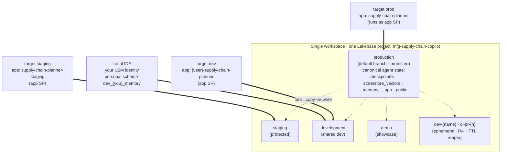
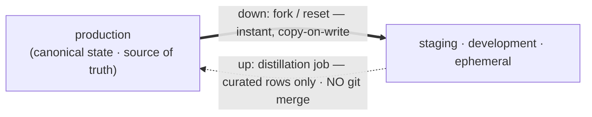

# Lakebase state lifecycle — dev → staging → prod

> How the agent's durable state (checkpointer + long-term/semantic store + operational hybrid
> query) is isolated and promoted across environments. Companion to
> [`lakebase-apps-permissions.md`](lakebase-apps-permissions.md) (SP/grant/orphan mechanics) and
> [`DEPLOY.md`](DEPLOY.md) (the one-shot deploy flow). Background research:
> *"Lakebase for Stateful Agents"* (field doc, 2026-06).

## The model: one project, branch-per-environment

All durable state lives on **Lakebase (Postgres)**. The vetted Lakebase pattern for stateful agents
is **one autoscaling project with a copy-on-write branch per environment** — *not* a separate
project or a schema prefix per environment. Branches are the isolation unit; the agent-memory
schema names stay **identical across branches** (isolation is the branch, not a name suffix).

- **Analytics layer** (UC catalogs/schemas) is separated independently via `uc_catalog`/`uc_schema`.
- **Tenant/domain** isolation would use separate *projects* (not relevant here).
- **Functional grouping** inside one DB uses *schemas* (we already do: `public` operational,
  `supply_chain_planner_memory`, `supply_chain_planner_app`).

Lakebase is **workspace-scoped**, so branch-per-environment assumes one workspace/project. If a
tier must live in its own workspace (e.g. a locked-down prod), use a separate project there and
point `lakebase_project` at it per-target.

## Topology



Every branch carries the **same schema names** — isolation is the branch, not a name prefix. Solid
arrows = a DABs target/app deploys to and reads+writes that branch; dotted arrows = copy-on-write
fork from `production`.

| Tier | DABs target | Lakebase branch | DABs mode | App name | SQL warehouse |
|------|-------------|-----------------|-----------|----------|---------------|
| Local IDE | — | `development` (via `.env`) | — | — | — |
| Dev | `dev` (default) | `development` | development | `<user>`-prefixed | bundle-created |
| Staging | `staging` | `staging` | production | `supply-chain-planner-staging` | bundle-created |
| Prod | `prod` | `production` | production | `supply-chain-planner` | bundle-created |
| Demo (legacy) | `demo` | `production` | production | `supply-chain-planner` | bundle-created |
| BYO (restricted ws) | `byo` | `production` | development | `<user>`-prefixed | **you provide** |

`production` is the Lakebase project's **default branch** (created with the project). `development`,
`staging` (and any `dev-*`/`ci-*`) are **forked from `production`** (copy-on-write) by the deploy
script. `demo` is retained as a showcase alias of `prod` (same branch + mode); use `prod` for the
lifecycle.

### What's isolated by branch vs. shared

- **Isolated per branch:** the LangGraph checkpointer tables, the `AsyncDatabricksStore`
  (`store` / `store_vectors`), the Meridian write-back tables (`supply_chain_planner_app`), and the
  operational synced tables (`public`). Each tier sees only its own copy.
- **Shared across tiers:** the analytics layer is governed by `uc_catalog`/`uc_schema`, which you
  set per-tier (`--var uc_catalog=...`). By default all tiers point at the same catalog; point
  staging/prod at their own governed catalogs when you want env-specific data.

## The bug this design fixes

Before this change, **every target resolved to `branch: production`** (the `lakebase_branch` var
default, never overridden per-target). So `make deploy TARGET=dev` wrote agent memory and
write-back rows **into the production branch** — dev iteration polluted prod state. Worse, because
`mode: development` prefixes the *app/experiment/warehouse names* by user but **not** the Lakebase
branch or schema names, two developers deploying `dev` to one workspace each got a distinct app SP
both trying to own the *same* schema on the *same* branch → the second hit the fatal
foreign-owned-schema crash (see [`lakebase-apps-permissions.md`](lakebase-apps-permissions.md)).

Branch-per-environment removes both problems: dev writes to `development`, prod to `production`,
and each tier's app SP owns its schema on its own branch.

## Branch provisioning (automated)

`scripts/ensure_lakebase_project.py` (deploy.sh **Phase 1**) now ensures **both the project and the
target branch**:

1. Get-or-create the autoscaling project (unchanged), wait until AVAILABLE.
2. Resolve the branch (`argv[2]` → `LAKEBASE_BRANCH` env → `settings.lakebase_autoscaling_branch`
   → `production`). deploy.sh passes the resolved per-target `lakebase_branch`.
3. If the branch exists → no-op (the common case: `production`, or a re-deploy).
4. If missing → **fork it from `production`** (copy-on-write). The Lakebase create API **requires an
   expiration policy**, so branches are created with `no_expiry: true` (long-lived). `dev-*`/`ci-*`/
   `pr-*` names are flagged **ephemeral** (recycled by the R4 TTL reaper); everything else
   (`production`/`staging`/`demo`/`development`) is long-lived.
5. If auto-create fails (e.g. an API/permission issue), it **fails loudly with the exact manual
   command** rather than letting the deploy proceed against a non-existent branch:
   ```
   databricks postgres create-branch projects/<project>/branches/<branch> \
     --json '{"spec": {"source_branch": "projects/<project>/branches/production", "no_expiry": true}}'
   ```

> Branch names must be RFC-1123: **lowercase, hyphens, no underscores**, ≤63 chars. The script
> rejects invalid names early. (This is why per-developer branches use `dev-<name>`, not the
> underscore-containing schema convention.)

> Caveat: the public **PITR/snapshot API (LKB-5185) is still maturing**, so promotion relies on
> *fork-from-parent + re-seed*, not snapshot-based cloning.

## Promotion across tiers

Branching is **one-directional**: `reset` flows parent → child; there is **no git-style
child → parent merge**.



- **Down (prod → staging/dev):** instant and free — fork or `reset` from `production`. Keep
  `staging` prod-shaped by resetting it from `production` on a schedule (future job).
- **Up (improve prod memory):** there is no merge. Schema changes are promoted by **idempotent DDL
  replay** (the `ensure_*` startup functions already use `CREATE ... IF NOT EXISTS`). Curated
  *memories* are promoted by a future **distillation job** (read candidate rows from the lower
  branch → filter/summarize/validate → write to `production` via a narrowly-scoped role). Canonical
  long-term memory lives on `production` from day one; lower branches are throwaway.

## Environment awareness

The DABs `bundle.target` is now surfaced to the running app as **`APP_ENV`** (`databricks.yml` →
app `config.env`). `agent_server/config.py` reads it as `settings.app_env` (default `"local"` for
IDE runs), and the agent tags every MLflow trace with `environment=<app_env>` so dev/staging/prod
traffic is separable in tracing/observability. The branch name alone was previously the only hint
of which environment the app was running in.

## Local development (validated 2026-06-16)

Run locally against a **non-production** branch with a **per-identity memory schema** — never the
app SP's schema. Reason: the production agent-state schemas (`supply_chain_planner_memory`,
`supply_chain_planner_app`, and the durable `agent_server`) are **owned by the deployed app service
principal**, and a copy-on-write fork **inherits that ownership**. A local U2M identity therefore
cannot create/write those schemas on `production` *or* on a branch forked from it —
`_ensure_role_owned_schema` fails fast with "owned by another role". (This is the desired
protection: local runs can't corrupt production state.)

For a clean local run, point `.env` at the `development` branch with personal schemas you own:

```
LAKEBASE_AUTOSCALING_BRANCH=development
LAKEBASE_AGENT_MEMORY_SCHEMA=dev_<you>_memory
LAKEBASE_WRITEBACK_SCHEMA=dev_<you>_app
```

The durable `agent_server` schema name is hard-coded in `databricks-ai-bridge` (not env-overridable);
its ownership error on a forked branch is **non-fatal** — it only degrades background mode, not the
synchronous invoke/stream path (so the eval harness runs clean). `DROP SCHEMA agent_server CASCADE`
on your dev branch + restart if you need background mode locally.

> Verified by running the flywheel against `development`: with a local-owned schema the agent ran
> all 6 sanity questions end-to-end (trace-shape scorers 1.0, gate 1.0, grounded 0.83) — proving the
> branch-per-env state path works from a local identity.

## Operational guardrails

- **Grants survive redeploys** because they're expressed as **app resources** (the `postgres`
  resource re-binds `CONNECT+CREATE`; warehouse `CAN_USE` and Genie `CAN_RUN` re-bind too).
  `SELECT` on the `public` synced tables is granted by the seed's `grant_app_sp` task — which does
  **not** run on `redeploy`/`--app-only`. After an SP recreate, re-run the seed (or just that task)
  to restore it.
- **Never delete the app — redeploy in place.** The app SP (and the Lakebase schemas it owns) is
  stable across redeploys but destroyed on app delete, orphaning its schemas. If you must recreate,
  **detach the Lakebase resource as `CAN MANAGE` first**. Full detail:
  [`lakebase-apps-permissions.md`](lakebase-apps-permissions.md).

## What this lands now vs. later

**Implemented (this change):**
- **R1** — per-target `lakebase_branch`; new `staging` and `prod` targets; dev moved off
  `production` onto `development`.
- **R2** — branch provisioning automation in `ensure_lakebase_project.py` (+ deploy.sh passes the
  branch).
- **R3** — `APP_ENV` surfaced from `bundle.target`, read into `settings.app_env`, stamped on traces.

**Future (tracked, not in this change):**
- **R4** — per-developer / per-PR ephemeral branches (`dev-<name>` / `ci-pr-<n>`) with a **TTL
  reaper** (hard limit: **10 unarchived branches/project**).
- **R5** — CI/CD: PR → ephemeral branch + deploy + run the `agent_server/evaluation/` flywheel as a
  regression gate; merge → staging; tag/approval → prod (OIDC workload-identity auth).
- **R6** — `make regrant` to re-apply `grant_app_sp` without a full seed.
- **R7** — staging `reset`-from-prod schedule + the memory distillation job.
- **R8** — per-branch state monitoring/GC (checkpoint/`store`/`store_vectors` growth, stale-thread
  cleanup).

## Usage

```bash
make deploy PROFILE=<p> TARGET=dev       # → development branch (default)
make deploy PROFILE=<p> TARGET=staging   # → staging branch (forked from production if missing)
make deploy PROFILE=<p> TARGET=prod      # → production branch
# Per-developer dev isolation (until R4 automates it):
make deploy PROFILE=<p> TARGET=dev --var lakebase_branch=dev-<yourname>
```
